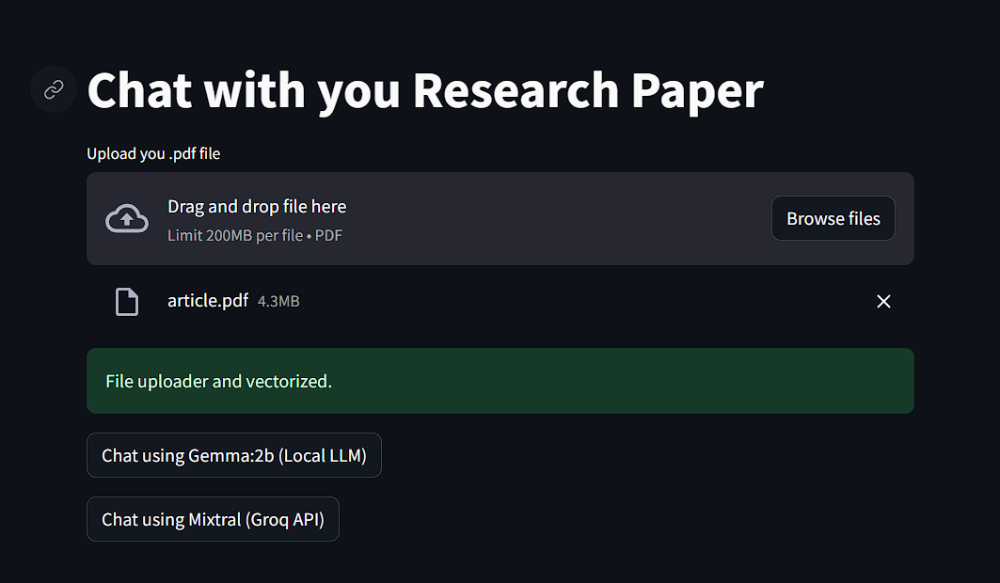
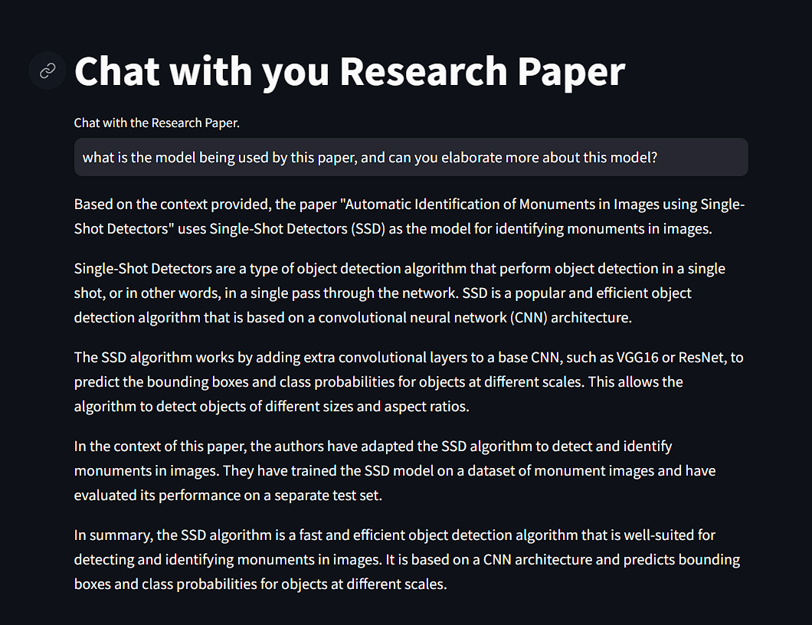

## A simple RAG application build for .pdf type with Streamlit which utilizes both local llm and Groq provided (glitched) llm API endpoint. 
### Minimalist UI Interface

PDF file upload interface, which takes some time depending upon system to vectorize documents with OllamaEmbedding and saves the vectors in a FAISS vector store.

      

After vectorizing, user has the option to choose the backend LLM model for chatting with the uploaded pdf file.

      

